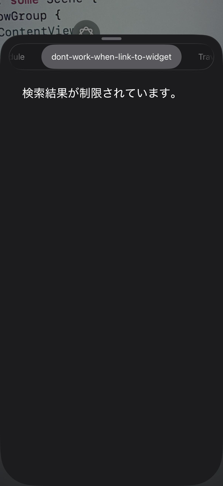

FB21556622

# Environment

Xcode Version 26.2 (17C52)

# Problem

Visual Intelligence displays an error under the following conditions.

## Build Conditions

- A module including Visual Intelligence intent is linked to both the app and a widget extension.

## Runtime Conditions

- An app is terminated (killed).
- A widget remains alive.

(I guess there is a fundamental rule for app intents: if app is terminated and widget is alive, intents runs on widget's process, However this rule is conflicting to the special rule for Visual Intelligence: expected to be in app's process.)

# Background

There is a valid strategy that making a shared intent module and link it to both an app and a widget.

# Workaround

separating modules: regular intents one and VisualIntelligence one. link both to an app, and only the former to widget. However, there is another problem I've reported `FB21555498` regarding separating intent modules.  
